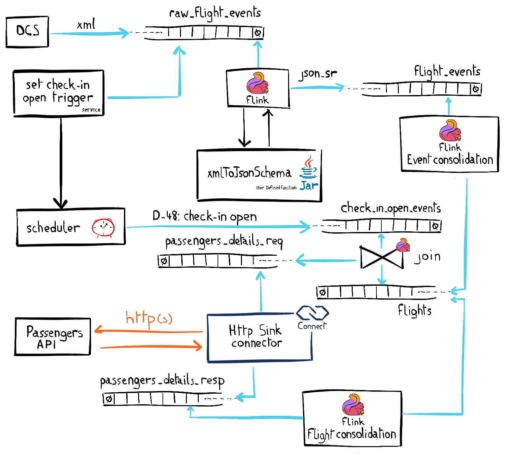
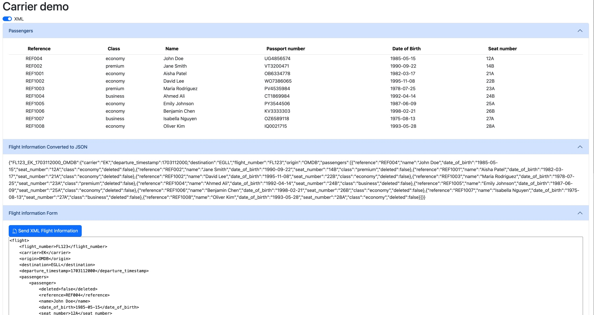

# Airline Demo

## Purpose

This demo is showcasing some common Complex Event Processing that you can find in the airline space:
- How to onboard all XML estate in a modern streaming platform
- How to process the delta between messages instead of the usual Stream-Table duality principle
- How a single event can trigger collecting information from an external API without requiring a bespoke coded consumer
- Avoiding alert floods: when an alert raises, avoid getting multiple alerts for the same subject for a configurable duration

## Setup 
Prerequisites: 
- Authenticate to your AWS account to provision the lambda function faking an external API.
- Provide Confluent Cloud API by creating the following environment variables: `TF_VAR_confluent_cloud_api_key` and  `TF_VAR_confluent_cloud_api_secret` 

Then just run the `setup.sh` script to spin up everything in Confluent Cloud and generate the local configuration files. 

Once done, from the terminal, browse to the `web-ui` subfolder to start locally the console to play with the data set and see the records updated in real time. Run `./mvnw clean compile exec:java` then browse to [http://localhost:8080]().

